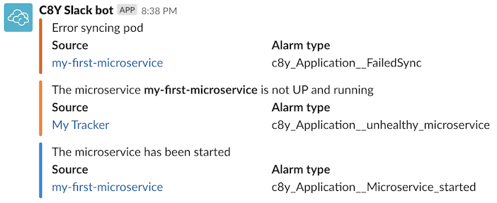

## Cumulocity Microservice 

[](https://app.codacy.com/app/manasesjesus/c8y_microservice_nodejs?utm_source=github.com&utm_medium=referral&utm_content=manasesjesus/c8y_microservice_nodejs&utm_campaign=Badge_Grade_Dashboard)

Cumulocity microservice developed using Node.js and Docker. It notifies a Slack channel when there are alarms in the subscribed tenants.

### Prerequisites

*   Local Docker installation.
*   A [Cumulocity IoT](https://cumulocity.com) account. Create a free trial to test this example.
*   Slack channel to post messages to, [Slack app and OAuth token](https://slack.dev/node-slack-sdk/getting-started).
*   A *.env* file in the root directory with the following content:

```properties
PORT=80
SLACK_OAUTH_TOKEN=<YOUR-TOKEN-GOES-HERE>
SLACK_CHANNEL_ID=<YOUR-CHANNEL_ID-GOES-HERE>
```

### Build

Execute the following commands to build the Docker image and save it as *image.tar*:

```shell
$ docker build -t mynode-microservice .
$ docker save mynode-microservice > "image.tar"
```

Then pack *image.tar* together with the manifest *cumulocity.json* into a ZIP file.

```shell
$ zip mynode-microservice cumulocity.json image.tar
```

The resulting *mynode-microservice.zip* file contains the microservice and it is ready to be uploaded to the Cumulocity platform.

### Deployment

Deploy the microservice application (refer to [Adding own applications](https://cumulocity.com/guides/users-guide/administration/#a-name-adding-applications-a-adding-own-applications) in the Cumulocity's User guide) and subscribe it afterwards. It may take some minutes for the ZIP file to be uploaded. 

### Execution

Use a web browser or a terminal command (e.g. cURL) to make a GET request to the microservice endpoints.

```http
GET <tenant-domain>.cumulocity.com/service/mynode-microservice/environment
```

The Slack channel will get the posted messages every time a new alarm is raised on the subscribed tenants.


